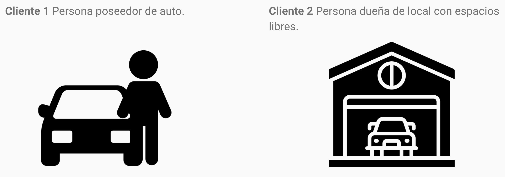
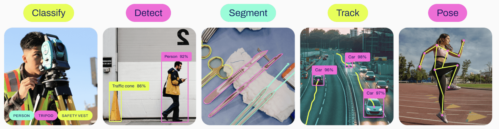
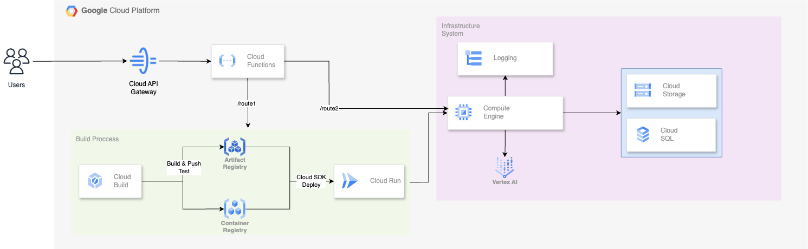
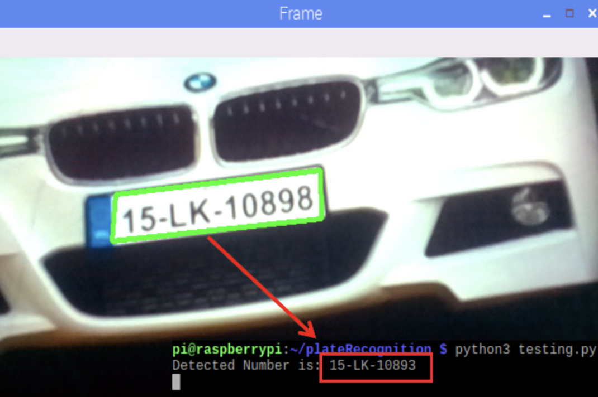
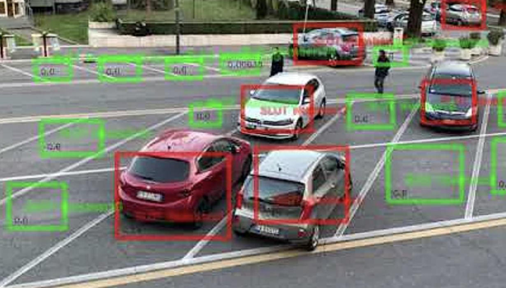
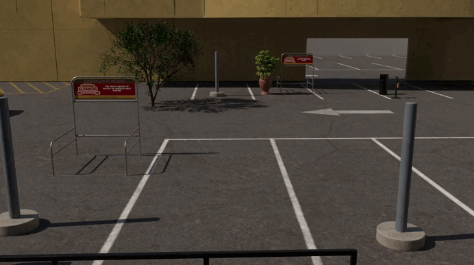
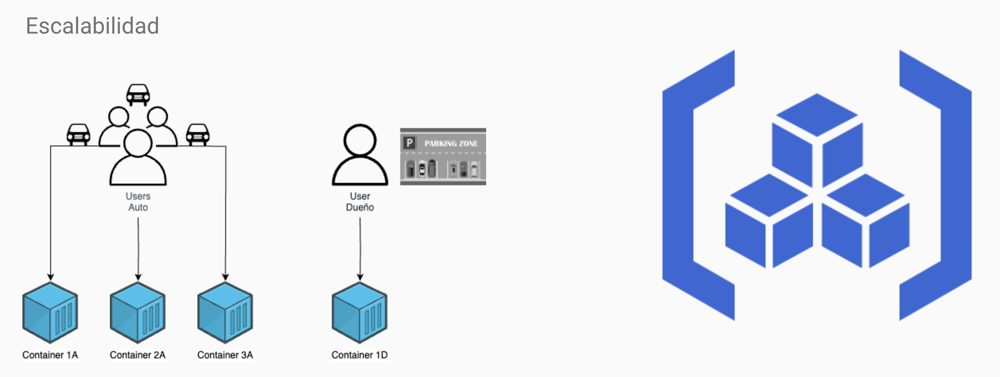
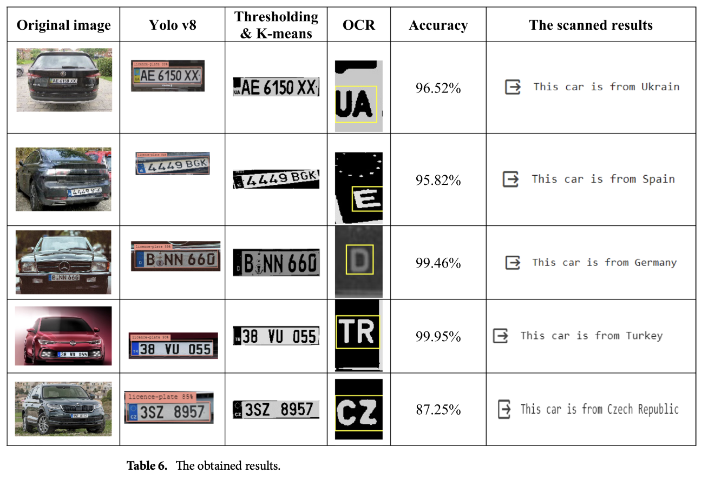
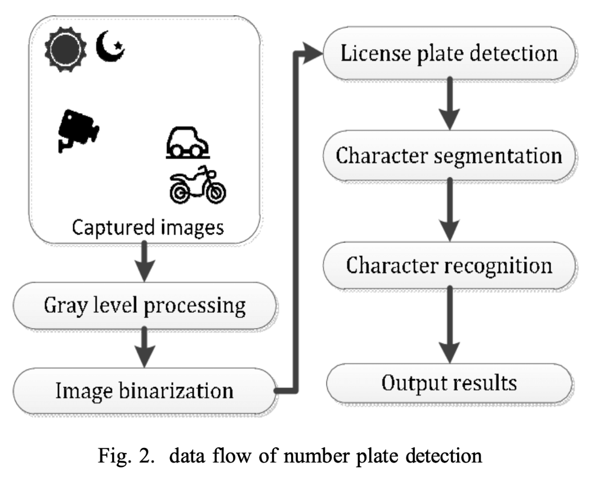

# Proyecto Cloud Computing

Este proyecto, llamado "Quadra", permite a los usuarios encontrar opciones de estacionamiento en alquiler cerca de su destino de manera eficiente y económica, utilizando tecnologías como OpenCV y YOLO para la detección automática de autos.

## Tabla de Contenido

1. [Introducción](#introducción)
2. [Contexto](#contexto)
3. [Características](#características)
4. [Arquitectura](#arquitectura)
5. [Funcionalidades](#funcionalidades)
6. [Implementación](#implementación)
7. [Tópicos de Cloud Computing](#tópicos-de-cloud-computing)
8. [Referencias](#referencias)

## Introducción

El objetivo de este proyecto es automatizar el proceso de detección y cobro de estacionamiento en tiempo real sin intervención humana, utilizando tecnologías como OpenCV para el reconocimiento óptico de caracteres (OCR) y YOLO para la detección de objetos.

## Contexto

Quadra ofrece múltiples opciones de cochera en alquiler cerca de tu ubicación de destino. Los usuarios pueden elegir el tiempo que desean estacionar su vehículo y obtener un precio asequible. El sistema funciona en tiempo real y utiliza inteligencia artificial para gestionar las plazas de estacionamiento.

**Objetivo:** Que el proceso de detección y cobro por estacionamiento del auto sea en tiempo real, sin intervención humana, utilizando OpenCV y YOLO.



- Cliente 1: Persona con auto.
- Cliente 2: Persona dueña de local con espacios libres.

## Características

1. **OpenCV - OCR**: Utilizado para la detección y reconocimiento de placas de vehículos.

   ```python
   def ocr_plate(plate_image):
       gray = cv2.cvtColor(plate_image, cv2.COLOR_BGR2GRAY)
       thresh = cv2.threshold(gray, 0, 255, cv2.THRESH_BINARY | cv2.THRESH_OTSU)[1]
       config = r'--oem 3 --psm 7 -c tessedit_char_whitelist=ABCDEFGHIJKLMNOPQRSTUVWXYZ0123456789'
       text = pytesseract.image_to_string(thresh, config=config)
       return ''.join(filter(str.isalnum, text))
   ```

2. **YOLOv8**: Implementado para clasificar, detectar, segmentar, y rastrear vehículos en tiempo real.

   

## Arquitectura

La arquitectura del proyecto está diseñada para utilizar servicios en la nube y procesamiento en tiempo real para lograr la detección eficiente de vehículos y su cobro automático. Incluye:

- API para comunicación entre el frontend y el backend.
- Procesamiento en la nube para almacenar y analizar datos.



## Funcionalidades

1. **Detección de Placas**: El sistema identifica las placas de los vehículos para registrarlos en la base de datos.
   

2. **Rastreo en Tiempo Real**: Se determina la ubicación y el tiempo de estancia del vehículo en la cochera.

3. **Identificación de Espacio y Tiempo**: El sistema detecta el espacio ocupado por el auto y calcula el tiempo de permanencia en el estacionamiento.
   

## Implementación

### Tecnologías Utilizadas

- **Python**: Lenguaje principal para el desarrollo del backend.
- **OpenCV y YOLO**: Para la detección y clasificación de imágenes en tiempo real.
- **Raspberry Pi**: Dispositivo utilizado para capturar y procesar las imágenes.

### Pasos para Implementar el Proyecto

1. Clonar el repositorio.
2. Instalar las dependencias necesarias desde `requirements.txt`.
3. Ejecutar el programa usando `src/app.py`.
4. Simular con las pruebas proporcionadas que incluyen dos videos de muestra.
5. En cada frame de los videos se detecta la placa del auto y se captura la información.
   
6. Se detecta el espacio ocupado por el auto.
7. Se calcula el tiempo transcurrido desde que el auto se estaciona.
   

## Tópicos de Cloud Computing

- **Escalabilidad**: La infraestructura utiliza servicios en la nube que permiten escalar automáticamente en función de la demanda.
- **API Gateway**: Controla el tráfico de solicitudes y asegura la integración entre frontend y backend.



## Referencias

1. [Enhancing automated vehicle identification by integrating YOLO v8 and OCR techniques for high-precision license plate detection and recognition](https://papers.ssrn.com/sol3/papers.cfm?abstract_id=4832568) (23 Mayo 2024)
   

2. [A Novel Car License Plate And Parking Slot Detection Approach Based on YOLO](https://www.researchgate.net/publication/381639203_Enhancing_automated_vehicle_identification_by_integrating_YOLO_v8_and_OCR_techniques_for_high-precision_license_plate_detection_and_recognition) (14 Junio 2024)
   
